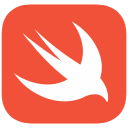

### Welcome to my digital realm~

Hello~! My name is Reina and I'm an IT & Computer Science student, passionate about AI, coding, and tech innovation. I enjoy working on AI agents, multi-tenant systems, and personalizing model outputs.

If you don't see me online, I'm probably experimenting with new ideas or simply recharging so I can come back with even more exciting projects.

Love you all~

---

#

  
- I’m a student from Vietnam.

- I like building things with <a href="https://www.python.org/">&nbsp;Python</a> and <a href="https://developer.apple.com/swift/">&nbsp;Swift</a> — little tools, small apps… nothing too grand, but each of them feels meaningful in its own way.

- I can read and understand code written in <a href="https://www.w3schools.com/cpp/">&nbsp;C++</a> and <a href="https://www.typescriptlang.org/">&nbsp;TypeScript</a>. It’s quite fun, actually, seeing how different ideas take shape in code.

- Lately, I’ve been exploring <a href="https://aws.amazon.com">&nbsp;AWS</a>, <a href="https://www.w3schools.com/cpp/">&nbsp;C++</a>, and <a href="https://www.docker.com/">&nbsp;Docker</a>. It’s been quite interesting, taking my time as I find my way into backend and DevOp :3

 

  *"There's a saying — the more demanding the diner, the stronger the skills of the chef... but no matter what others say, I'll always be demanding more from myself." – Robin.* 

## Discord

## My stats:

  

## Commits

---

# EOF~
## Thanks for reading ❤️
